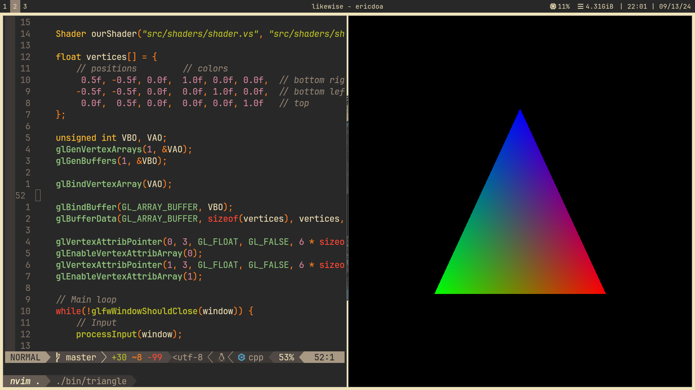
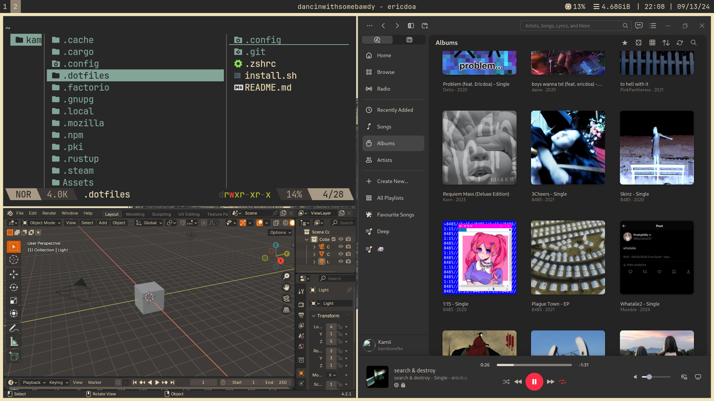

# What I use:
- WM - [Sway](https://swaywm.org/)
- Shell - [zsh](https://zsh.org/)
- Terminal - [Kitty](https://github.com/kovidgoyal/kitty)
- IDE - [neovim](https://neovim.io/)
- File manager - [Yazi](https://github.com/sxyazi/yazi)
- Browser - [Firefox Developer Edition](https://www.mozilla.org/en-US/firefox/developer/)
- Music player - [Cider](https://cider.sh/)
- 3D graphics - [Blender](https://www.blender.org/)

# Showcase




# Wallpaper
[Link](https://gruvbox-wallpapers.pages.dev/wallpapers/light/Sif.png)

# Instalation:
> [!CAUTION]
> I am not 100% sure that the installer will work.
```sh
git clone https://github.com/kamilkonefke/.dotfiles.git
cd .dotfiles
./install.sh
```
