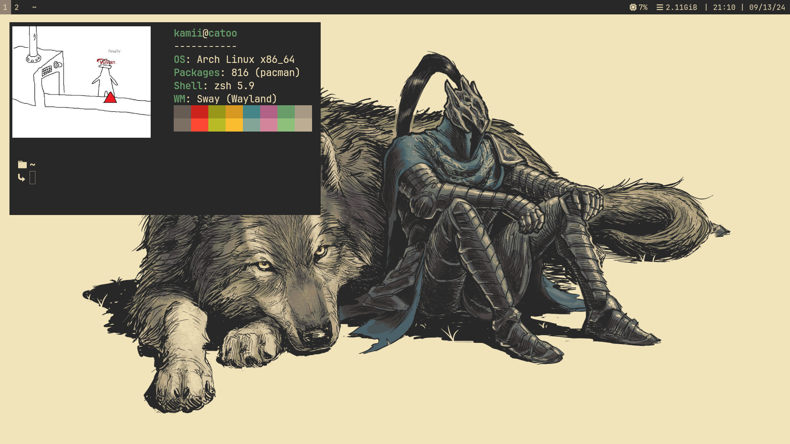

# What I use:
- WM - [Sway](https://swaywm.org/)
- Shell - [zsh](https://zsh.org/)
- Terminal - [Ghostty](https://ghostty.org/)
- IDE - [neovim](https://neovim.io/)
- File manager - [Yazi](https://github.com/sxyazi/yazi)
- Browser - [Firefox](https://www.mozilla.org/en-US/firefox)
- Music player - [Cider](https://cider.sh/)

# Showcase

